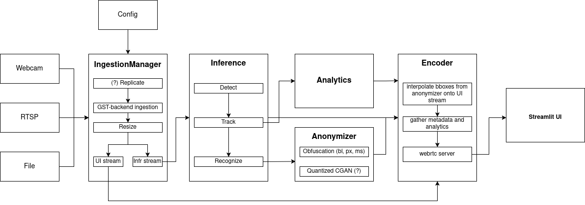

# SecureSurveillance: ARM-Targeted PPFR Framework

## Abstract

This project implements PPFR framework designed for deployment on resource-constrained embedded systems, specifically targeting Raspberry Pi. The system serves as the foundational infrastructure for a Privacy-Preserving Face Recognition (PPFR) research project, developed as part of a Bachelor of Science diploma thesis.

## Introduction

The framework provides a modular architecture for real-time video frame ingestion, models inference and streaming the results. The current implementation focuses on efficient frame ingestion and MJPEG streaming, with planned extensions for detection, tracking, recognition, and analytics modules.
## System Architecture



## Development Status

| Component | Status                  |
|-----------|-------------------------|
| IngestionManager | Implemented             |
| Inference | Planned                 |
| Analytics | Planned                 |
| Anonymizer | Planned                 |
| Encoder/Streamer | MJPEG now, later WebRTC |
| UI | WIP                     |

## Target Platform Specifications

- **Primary Platform**: Raspberry Pi
- **Compatible Platforms**: ARM-based single-board computers
- **Architecture Support**: aarch64
- **Operating System**: Linux-based distributions (Raspberry Pi OS, Ubuntu ARM, etc.)

## Requirements

### Build Dependencies

- CMake 3.16 or higher
- C++17 compatible compiler (GCC/Clang)
- OpenCV
- GStreamer 1.0 and development libraries
- yaml-cpp library
- [httplib](https://github.com/yhirose/cpp-httplib)

### Runtime Dependencies

- Python 3.x
- Streamlit
- requests library

## Configuration

System configuration is managed through YAML files located in the `configs/` directory. Example config.yaml:

```yaml
server:
  host: "0.0.0.0"
  port: 8080
streams:
  - id: "rtsp0"
    type: "rtsp" # file|webcam|rtsp

    rtsp:
      url: "rtsp://example/url"
      tcp: true
      fps: 15
      latency_ms: 1000

    outputs:
      fps: 15 # shared by inference and ui profiles
      profiles:
        inference:
          width: 640
          height: 640
          format: "BGR"
        ui:
          width: 1280
          height: 720
          keep_aspect: true
          interp: "linear" # linear|cubic|area|nearest
          jpeg_quality: 85

    replicate:
      count: 2
```

## Usage

### Core Service Execution

```bash
./build/apps/core_service/core_service [config_path]
```

If no configuration path is specified, the system defaults to `configs/dual.yaml`.

The service initializes the following endpoints:
- MJPEG video stream: `http://host:port/video/<src_id>/<profile>`
- Metadata endpoint: `http://host:port/meta/<src_id>/<profile>`
- Available streams: `http://host:port/streams`
- Last frame from stream: `http://host:port/snapshot/<src_id>/<profile>`
- Health: `http://host:port/health`

### Web Interface

```bash
streamlit run ui/app.py
```

The interface is accessible at `http://localhost:8501` 

## API Specification

### Endpoints

#### GET /video/<src_id>/<profile>
- **Content-Type**: `multipart/x-mixed-replace; boundary=--boundary`
- **Description**: Continuous MJPEG video stream

#### GET /meta/<src_id>/<profile>
- **Content-Type**: `application/json`
- **Description**: Frame metadata in JSON format

### Metadata Response Format

```json
{
  "stream_id": "rtsp0_0",
  "profile": "main",
  "frame_id":425,
  "pts_ns":103806765745,
  "w":1280,
  "h":720
}
```

## Project Structure

```
.
├── apps/
│   └── core_service/          # Main application entry point
├── core/                      # Core library implementation
│   ├── include/               # Header files
│   └── src/                   # Implementation files
├── configs/                   # Configuration files
├── tests/                     # Unit and integration tests
└── ui/                        # Streamlit web interface
```

## Performance Optimization

For optimal performance on ARM platforms:

1. **Resolution**: Use 640x480 or 800x600 for real-time processing
2. **Frame Rate**: Limit to 15-20 FPS if frame drops occur
4. **Memory**: Monitor memory usage; consider frame buffer size reduction if needed
